=================================
This project pretends to be a open source device that could help people fighting against the COVID-19.
# Who are we?
*Estimados Miembros: Este grupo está conformado por alumnos, profesores y egresados de la FP-UNA y tiene por objetivo pensar, formular y realizar acciones concretas ante esta situación adversa que vivimos en el país con respecto al coronavirus COVID-19. Iniciamos con gente del área de electrónica e informática pero no estamos cerrados de ninguna manera. El trabajo es voluntario y sin fines de lucro. A hombros de gigantes enfrentaremos mejor las adversidades.*

Dear Members: This group is made up of students, professors and graduates of the FP-UNA and its objective is to think, formulate and carry out concrete actions in the face of this adverse situation that we are experiencing in the country with respect to the COVID-19 coronavirus. We started with people from the electronics and computing area but we are not closed in any way. The work is voluntary and non-profit. On the shoulders of giants we will better face adversities.

Team FP-UNA/COVID

# What we want to achieve?
The board is based on the website called [www.electroschematics.com](www.electroschematics.com) and the project is called [Automatic soap dispenser IR proximity sensor](https://www.electroschematics.com/automatic-soap-dispenser-ir-proximity-sensor/).

We want to use this board and use to dispense gel alcohol adapting it on differents bottles. 

# What we will find inside this repository?

Fist to all we will find the board.

The Board was designed using the software [KiCad 5.1.2](https://www.kicad-pcb.org)

The components are chosen by the existence on the Paraguay electronics componentes market.

## The schmematic

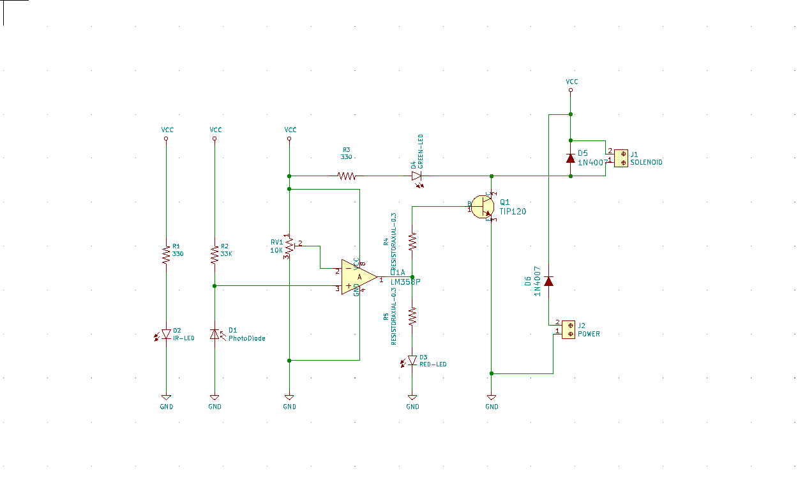

## The board

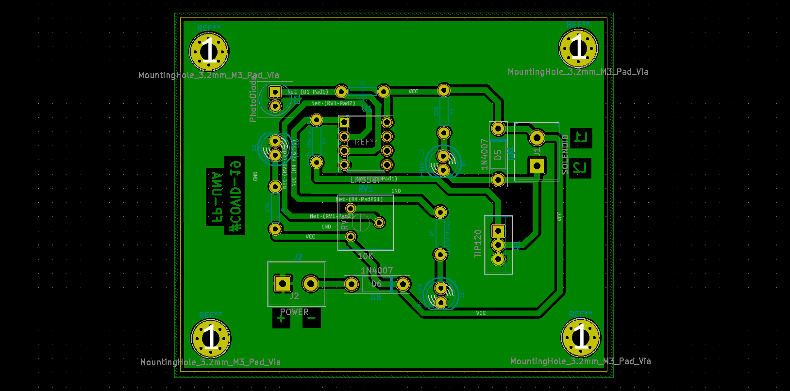

## Bill Of Materials
This is the file of the [BOM](InfraRedGelUniversalDispenser/bom/ibom.html)
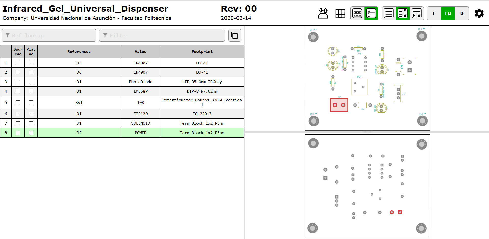

## The 3D models

You will find the board 3D model in the STP format in order you can choose the software you want to develope the mechanism with.

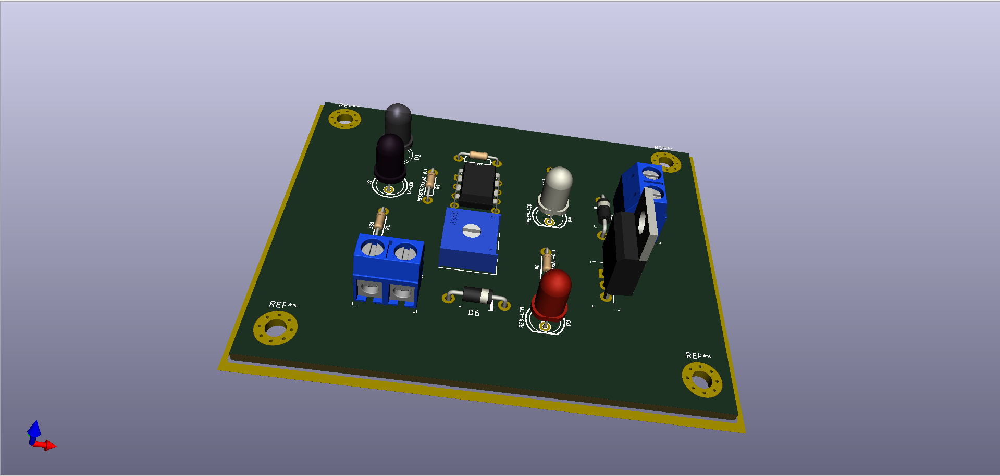
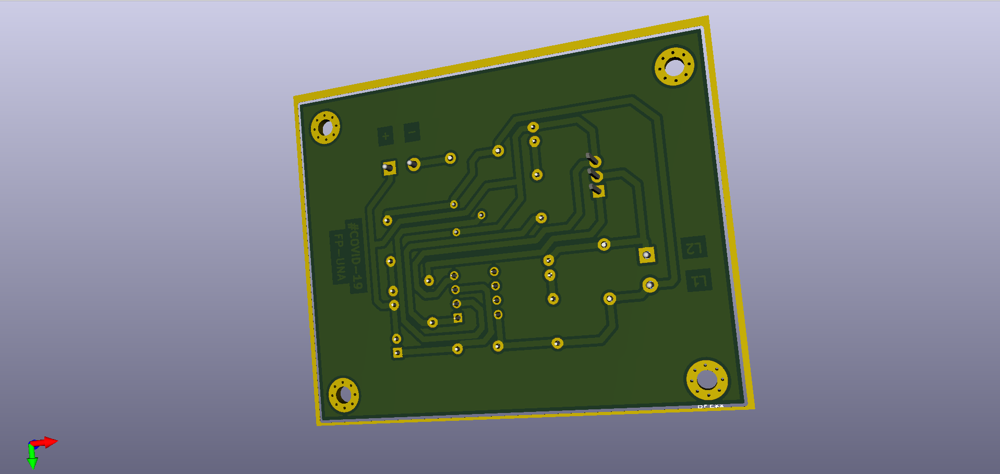

### Desing the mechanism using [Fusion 360](https://www.autodesk.com/products/fusion-360/students-teachers-educators)

#### Electronic board

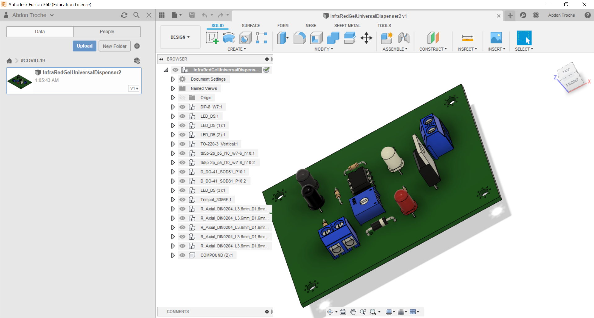

#### [Dispenser mecanism](InfraRedGelUniversalDispenser/CustomizedSolenoid v5.step)

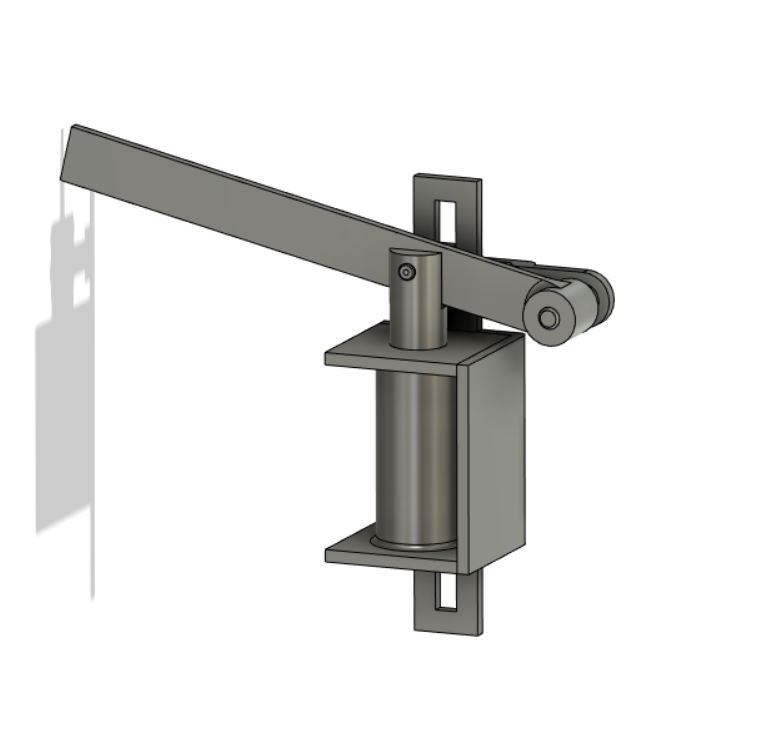

#### [Gel alcohol bottle or soap bottle dispenser](https://grabcad.com/library/soap-dispenser-5)

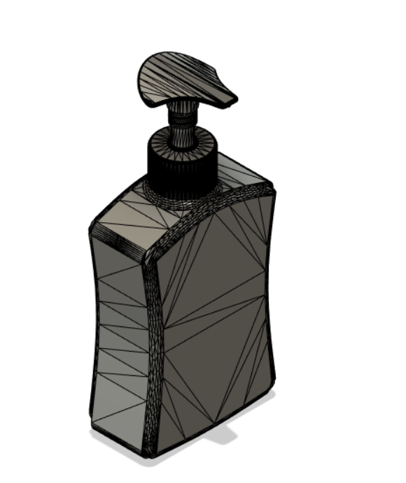

#### Fisrt assembly

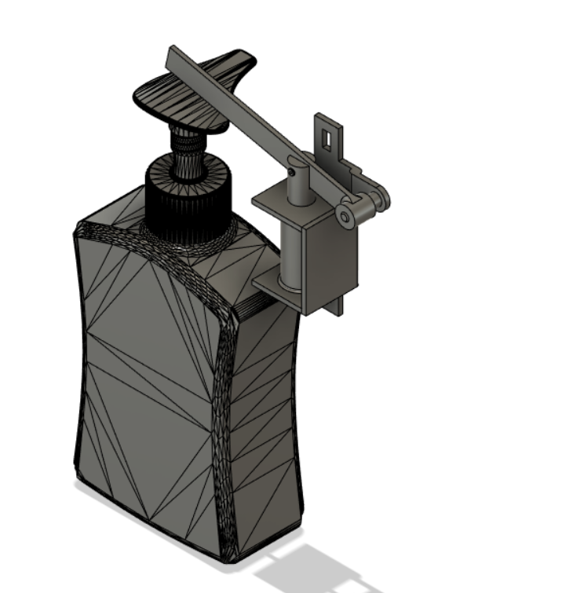

#### Second assembly

File of the prototipe "InfraRedGelUniversalDispenserDevice v17.step"

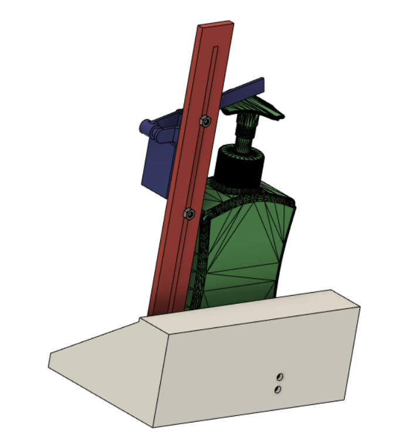

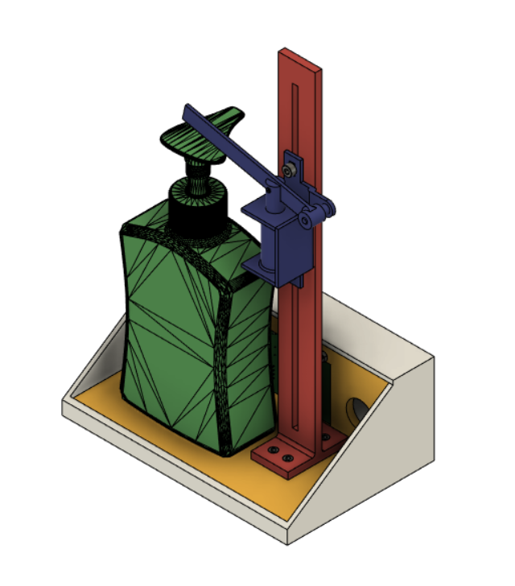

# This is another version of the board
## The schmematic

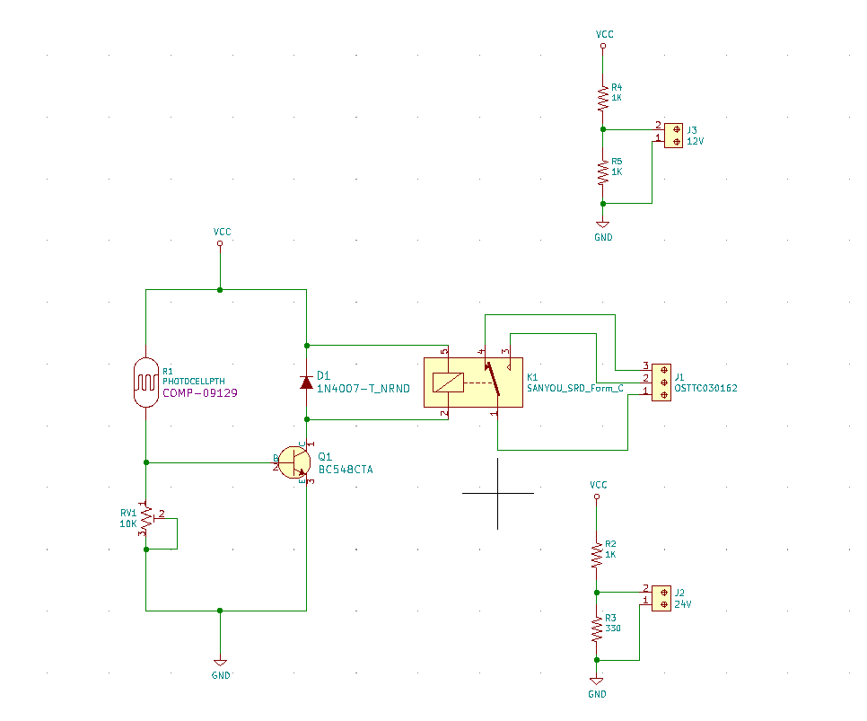

## The board

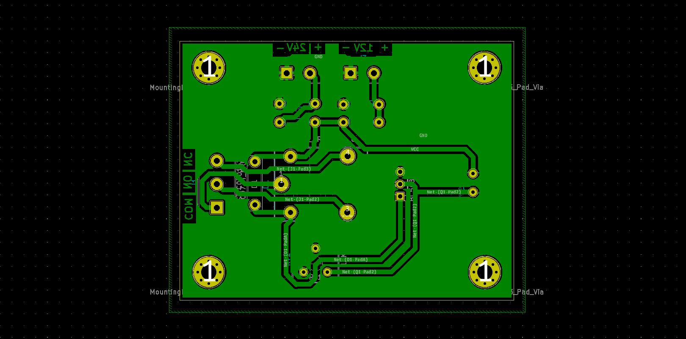

## Bill Of Materials

## The 3D models

You will find the board 3D model in the STP format in order you can choose the software you want to develope the mechanism with.

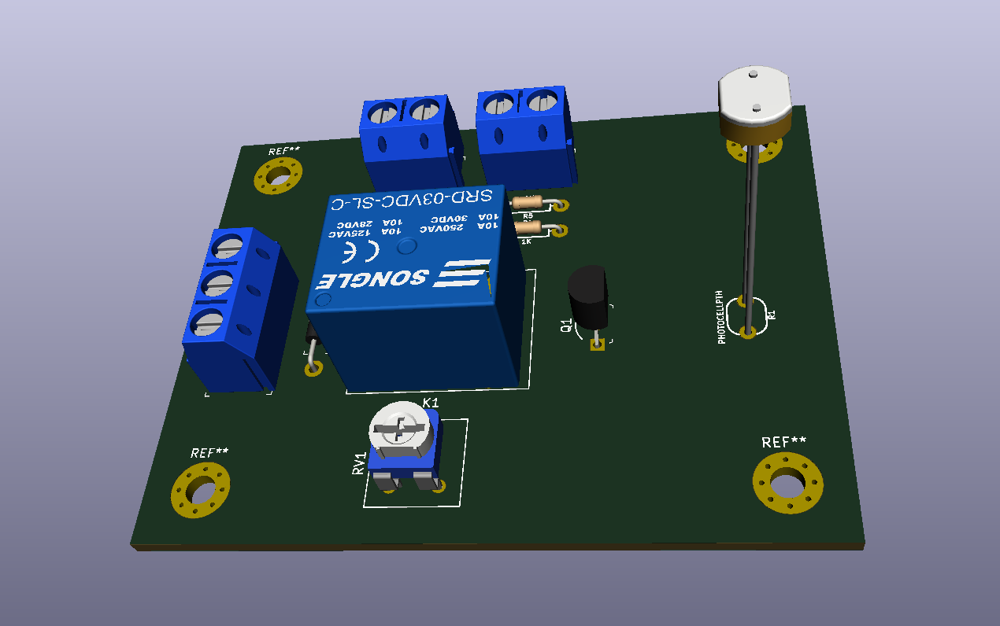
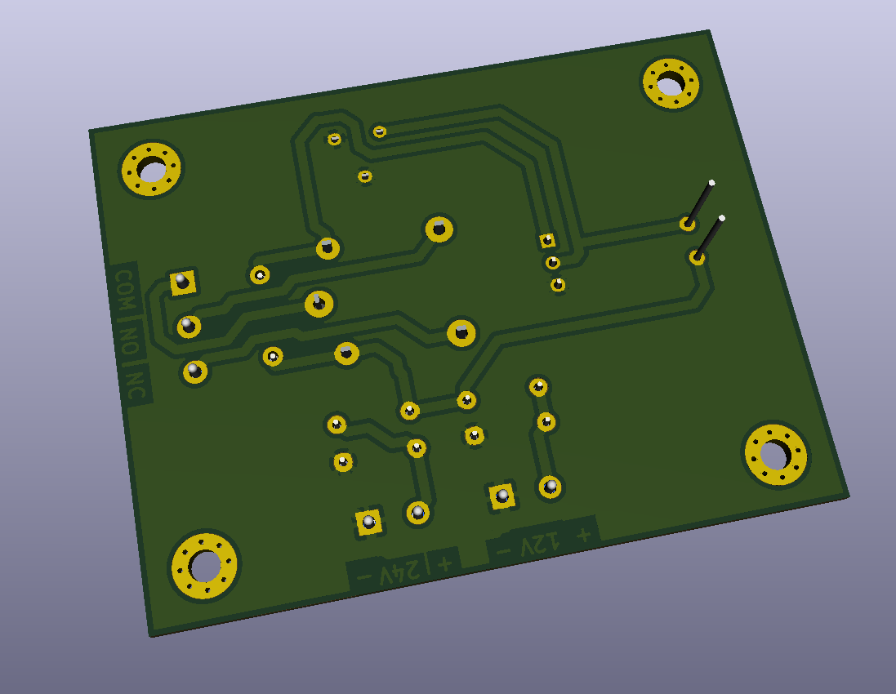

### Desing the mechanism using [Fusion 360](https://www.autodesk.com/products/fusion-360/students-teachers-educators)

#### Electronic board

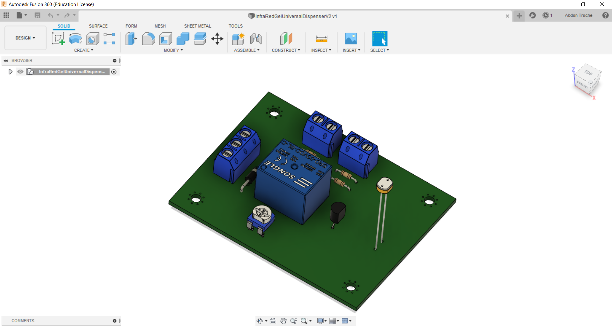